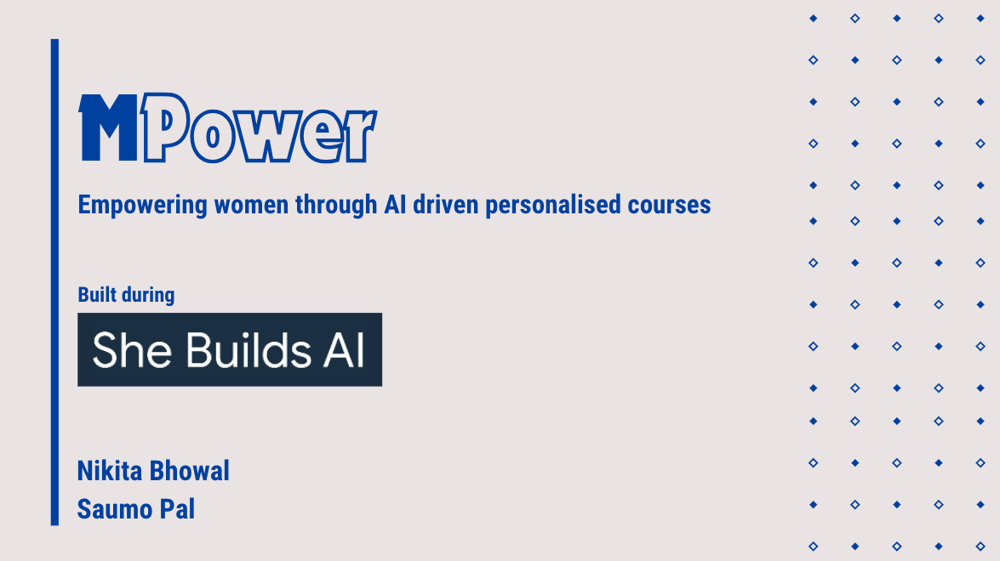
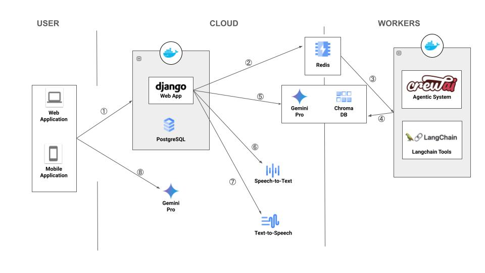
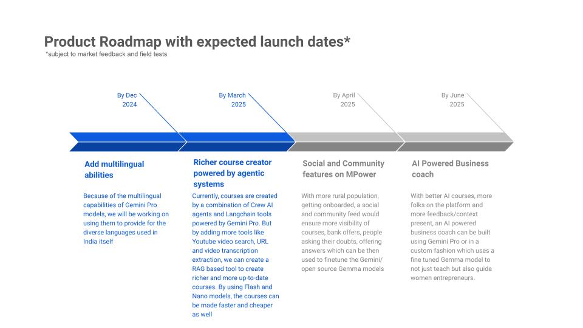

# MPower - Empowering women through AI driven personalised courses
## Inspiration

Many women, particularly in rural and agricultural communities, like Africa, India, SE Asia, depend on climate-sensitive industries like farming, livestock rearing, or fishing. As climate change disrupts weather patterns, causes crop failures, or diminishes water resources, these women are left vulnerable to losing their primary source of income.

In many communities, women are already economically marginalised, and climate-induced loss of income exacerbates poverty and gender inequality. Finding sustainable, alternative livelihood opportunities is challenging, especially in rural areas with limited access to formal education, resources, or markets.
Hence, MPower focuses on using generative AI to provide climate-affected women with sustainable, alternative livelihoods.

## Demo Video

## What it does

MPower would use generative AI to create tailored livelihood suggestions based on available local resources, skills, and climate conditions. It could help women transition to new, sustainable income-generating activities that are more resilient to climate change. The AI could also generate business ideas, provide training recommendations, and connect users to microfinance loan programs. A couple of examples below to drive home the idea:

### Use Case: Indigenous Women in the Amazon Transitioning to Eco-Tourism
#### Scenario:
In the Amazon rainforest, indigenous women have traditionally relied on small-scale agriculture and forest gathering to sustain their families. However, deforestation and climate change are reducing forest resources and threatening biodiversity, making traditional livelihoods unsustainable.

#### Problem:
The women face increasing pressure to adapt to climate change while preserving their cultural heritage and protecting the forest.

#### Solution:
The generative AI platform suggests that the women develop eco-tourism ventures, showcasing their indigenous culture, knowledge of the forest, and sustainable practices. It helps generate eco-tourism packages, from cultural tours to forest conservation workshops, providing step-by-step guidance on building tourism infrastructure, setting up digital payment systems, and managing bookings.

#### Training Resources:
The AI offers training on hospitality management, cultural storytelling, and environmental conservation practices. It also helps women learn basic digital skills to market their services online.

#### Outcome:
Indigenous women transition to eco-tourism, attracting tourists interested in sustainable travel and cultural experiences. This creates a new revenue stream that empowers the community while raising global awareness of Amazon rainforest preservation. The women maintain control over their cultural heritage while also benefiting economically.

### Use Case: Women in Sub-Saharan Africa Adopting Solar Energy Businesses
#### Scenario:
In many parts of Sub-Saharan Africa, women rely on wood or charcoal for cooking, which contributes to deforestation and exposes them to health hazards due to smoke inhalation. With climate change intensifying droughts, wood becomes scarcer, further threatening their livelihoods.

#### Problem:
These women need alternative energy sources for cooking and heating, but they lack the technical skills and financial resources to adopt cleaner energy technologies like solar power.

#### Solution:
The AI platform recommends solar energy entrepreneurship, suggesting that the women transition to selling solar-powered cookstoves and solar home systems. Based on their local market, the platform generates a business plan for a small-scale solar energy venture, including a supply chain, pricing strategy, and marketing approach.

#### Training Resources:
The platform offers training on assembling, maintaining, and marketing solar-powered products. It also provides connections to microloan programs to help women secure the initial capital for purchasing solar equipment.

#### Outcome:
The women successfully establish solar energy businesses, reducing deforestation and indoor air pollution while generating income. They become local leaders in promoting clean energy, improving community health, and contributing to climate resilience.

More usecases can be found in our [description document](https://github.com/SaumoPal97/MPower/blob/main/DESCRIPTION.md).

## How we built it

The project is built as a dockerized full stack app powered by React on the frontend and Django on the backend. It uses Postgres, Redis and Chroma DB as well. Google Gemini, Google Text-to-Speech & Speech-to-Text powers the AI features of the app.

### For Courses
1. The user comes to the webapp (web/mobile) and asks AI to create a course
2. Basic information regarding the course is saved on Postgres DB and then sent to Celery workers for creating the course
3. Crew AI agentic system picks up the tasks and using a combination of Google Gemini Pro and Langchain tools, create a complete course end-to-end
4. The course is then converted into embeddings using Google's embedding models and stored in ChromaDB
5. When the user goes through the course, she sees a AI chatbot. When she queries the chatbot for questions and doubts, an AI generated response is returned by running RAG on Gemini Pro and previously created embeddings
6. (Optional) Users can ask questions through speech to the AI chatbot via Google Speech-to-Text
7. (Optional) Users can listen to AI responses through Google Text-to-Speech
8. User can also ask Gemini Pro powered chatbot for course suggestions based on her profile

### For Bank Offers
1. The bank officer comes to the webapp (web/mobile) and adds a new microfinance loan offer
2. Basic information regarding the bank is saved on Postgres DB and then sent to Celery workers for extracting data from the bank offer pdf and url
3. A celery process picks up the task and using a combination of Google Gemini Pro and Langchain tools, extracts all information regarding the loan from the bank offer pdf and bank url
4. The offer details are then converted into embeddings using Google's embedding models and stored in ChromaDB
5. When the user checks out all the bank offers, she sees a AI chatbot. When she queries the chatbot for questions and doubts, an AI generated response is returned by running RAG on Gemini Pro and previously created embeddings
6. (Optional) Users can ask questions through speech to the AI chatbot via Google Speech-to-Text
7. (Optional) Users can listen to AI responses through Google Text-to-Speech

## Challenges we ran into

- Getting course creator agents up and running with [crewai](https://crewai.com)
- Getting live audio blob transcription using Google Speech-to-Text
- Setting up accurate prompts for concise and accurate course chapter creation
- Getting Langchain's OnlinePDFLoader up and running to parse bank pdfs

## Accomplishments that we're proud of

We are really excited to get the V1 of MPower up and running which currently does the following
- AI powered course suggestions based on the students' profiles
- AI powered personalised course builder
- AI chatbot to ask course related doubts
- AI powered tool to analyse bank offers and build a knowledge base
- AI chatbot to ask best bank offers and offer related doubts
- TTS and STT features on our AI chatbot for easier usage

## What we learned

- Learnt a lot about the current plight of women in rural areas affected by climate changes and its repercussion on their heath, safety and children
- Learnt how to setup agentic systems using crewai and Google Gemini
- Learnt and used Google Speech-to-Text and Text-to-Speech APIs for the first time

## What's next for MPower

- Provide multilingual support to address the needs of rural women from diverse backgrounds
- Build a richer, faster and affordable course creator functionality powered by Gemini Pro, Flash and Nano models
- Incorporate social and community tools for women entrepreneurs across the world to interact and share their knowledge
- Launch V1 of an AI powered business coach to not just help women entrepreneurs learn new business courses but also help them launch, scale and become financially successful in their endeavour

## How to run the project

### Backend

1. Run `cd backend/`
2. Make a copy of `.env.sample`, name it `.env` and fill the variables
3. Run `docker-compose -f docker-compose.yml build`
3. Run `docker-compose -f docker-compose.yml up`

### Frontend

1. Run `cd frontend/`
2. Run `npm install`
3. Make a copy of `.env.sample`, name it `.env` and fill the variables
4. Run `npm run dev`